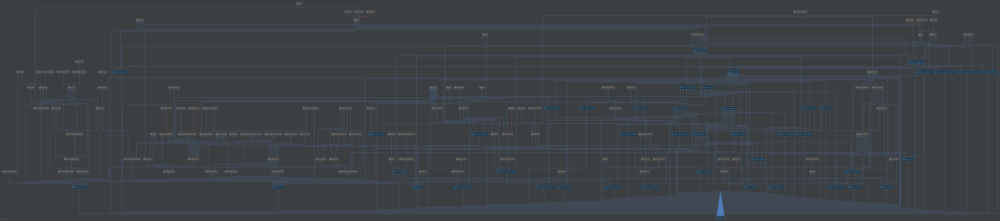

# dubbo 项目结构

[TOC]

## 项目结构
+ Dubbo
    + dubbo-bootstrap
    + dubbo-common
    + dubbo-config
        + dubbo-config-api 
        + dubbo-config-spring 
    + dubbo-container
        + dubbo-container-api
        + dubbo-container-log4j
        + dubbo-container-logback
        + dubbo-container-spring
    + dubbo-filter
        + dubbo-filter-cache
        + dubbo-filter-validation
    + dubbo-monitor
        + dubbo-monitor-api
        + dubbo-monitor-default
    + dubbo-plugin
        + dubbo-qos
    + dubbo-registry
        + dubbo-registry-api
        + dubbo-registry-default
        + dubbo-registry-multicast
        + dubbo-registry-redis
        + dubbo-registry-zookeeper
    + dubbo-remoting
        + dubbo-remoting-api
        + dubbo-remoting-grizzly
        + dubbo-remoting-http
        + dubbo-remoting-mina
        + dubbo-remoting-netty
        + dubbo-remoting-netty4
        + dubbo-remoting-p2p
        + dubbo-remoting-zookeeper
    + dubbo-rpc
        + dubbo-rpc-api
        + dubbo-rpc-dubbo
        + dubbo-rpc-hessian
        + dubbo-rpc-http
        + dubbo-rpc-injvm
        + dubbo-rpc-memcached
        + dubbo-rpc-redis
        + dubbo-rpc-rmi
        + dubbo-rpc-thrift
        + dubbo-rpc-webservice
    + dubbo-serialization
        + dubbo-serialization-api
        + dubbo-serialization-fastjson
        + dubbo-serialization-fst
        + dubbo-serialization-hessian2
        + dubbo-serialization-jdk
        + dubbo-serialization-kryo

## dubbo-bootstrap

引导模块

定义了通过程序式 API 启动和关闭 Dubbo 。在 Dubbo 关闭的时候，负责清理相关的资源。

## dubbo-cluster

集群模块

该模块是dubbo实现的集群模块。支持远程服务的集群，支持多种集群调用策略，包括failover,failsafe,failfast,failback,forking等。并且支持目录服务，注册中心就是目录服务的一种实现，支持负载均衡，该模块还实现了路由器特性，此外还包括合并技术，当将调用请求分发给所有的服务提供者，则会返回多个结果，则将多个结果合并需要用到合并器的实现，该模块也是非常重要的一个模块。

## dubbo-common

通用模块

定义了几乎所有dubbo模块都会使用到的一些通用与业务领域无关的工具类（io处理、日志处理、配置处理、类处理等等），线程池扩展、二进制代码处理、class编译处理、json处理、数据存储接口，系统版本号等等通用的类和接口。    

## dubbo-config

配置模块

通过它的配置和组装将dubbo组件的多个模块整合在一起给最终的开发者提供有价值的分布式服务框架。通过它的配置可以让开发者选择符合自己需求和使用场景的模块和技术，它定义了面向dubbo使用者的各种信息配置，比如服务发布配置、方法发布配置、服务消费配置、应用程序配置、注册中心配置、协议配置、监控配置等等。另外还有一个spring的配置模块，定义了一些spring的XML Schema，能够大大简化使用dubbo的配置，可以大大降低spring使用场景的学习和配置成本。

## dubbo-container

容器模块

定义了启动容器列表的包含应用程序入口main方法的类Main；定义了容器接口Container，该接口包含了启动和停止方法定义；还有一些通用的分页功能的相关类。dubbo内置了javaconfig、jetty、log4j、logback和spring几种容器的实现。

## dubbo-filter

过滤器模块

主要定义了Dubbo服务接口的缓存和参数校验。

## dubbo-monitor

监控模块

通过该模块可以监控服务调用的各种信息，例如调用耗时、调用量、调用结果等等，监控中心在调用过程中收集调用的信息，发送到监控服务，在监控服务中可以存储这些信息，对这些数据进行统计分析，最终可以产生各种维护的调用监控信息。dubbo默认提供了一个实现，该实现非常简单，只是作为默认的实现范例，生产环境使用价值不高，需要自行实现自己的监控。

## dubbo-plugin

插件模块

主要是Dubbo的服务质量控制模块（dubbo-qos）,命令行监控。

## dubbo-registry

注册模块

定义了核心的注册中心接口和实现。具体实现留给了其它项目。有一个默认的实现模块，组册中心提供了mutilcast、redis和zookeeper等多种方式的注册中心实现，用于不同的使用场景。

## dubbo-remoting

远程通讯模块

。rpc的实现基础就是远程通讯，consmer要调用provider的远程方法必须通过网络远程通讯实现。该模块定义了远程传输器、终端（endpoint）、客户端、服务端、编码解码器、数据交换、缓冲区、通讯异常定义等等核心的接口及类构成。他是对于远程网络通讯的抽象。提供了诸如netty、mina、grizzly、http、p2p和zookeeper的协议和技术框架的实现方式。

## dubbo-rpc

远程过程调用模块

分布式服务框架的核心是rpc，这是最基本的功能，这个模块定义了rpc的一些抽象的rpc接口和实现类，包括服务发布，服务调用代理，远程调用结果及异常，rpc调用网络协议，rpc调用监听器和过滤器等等。该模块提供了默认的基于dubbo协议的实现模块，还提供了hessian、http、rest、rmi、thrift和webservice等协议的实现，还实现了injvm的本地调用实现，灵活性强，非常通用，能够满足绝大多数项目的使用需求，而且还可以自行实现rpc协议。

## dubbo-serialization

序列化模块

序列化模块主要包括序列化接口，及基于fastjson、fst、hessian2、jdk、kryo等协议的实现。

